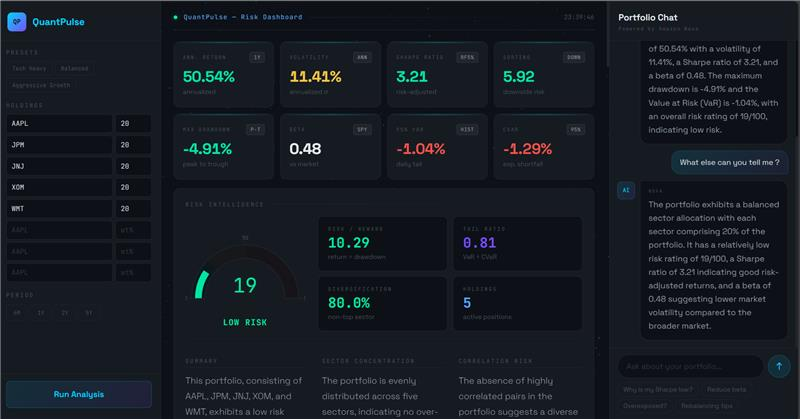

<div align="center">


# QuantPulse

**Algorithmic portfolio risk intelligence, powered by AI**

[](https://devpost.com)
[](https://aws.amazon.com/bedrock)
[](https://tavily.com)
[](https://alphavantage.co)
[](https://python.org)
[](https://fastapi.tiangolo.com)
[](https://dash.plotly.com)
[](https://langchain-ai.github.io/langgraph)

*Enter your portfolio. Get institutional-grade risk analysis in seconds. Ask the AI anything.*

</div>

---

## What it does

Most retail investors know their holdings. They don't know their risk.

QuantPulse runs a full quantitative risk engine on your portfolio — Value at Risk, Sharpe Ratio, Beta, Max Drawdown, Correlation Matrix — then passes the results to a LangGraph agent on Amazon Nova Lite that interprets the numbers in plain English and delivers specific, actionable recommendations. Live market news is fetched via Tavily and matched to your holdings. A context-aware chat lets you ask follow-up questions directly.

**Built for [AlgoFest Hackathon 2026](https://algofest-hackathon26.devpost.com) · Track: FinTech Innovations / AI & ML**

---

## Demo

> 

---

## Stack

| Layer | Tech |
|---|---|
| Agent | LangGraph (`StateGraph` + sequential nodes) |
| LLM | Amazon Nova Lite via AWS Bedrock |
| News | Tavily Search API |
| Market Data | Alpha Vantage API + yfinance fallback |
| Quant | NumPy · Pandas · SciPy |
| Backend | FastAPI + Uvicorn |
| Frontend | Plotly Dash + Dash Bootstrap Components |
| Deployment | Railway |

---

## Rate Limits

> **Important — read before running**

| Service | Free Tier Limit | Notes |
|---|---|---|
| Alpha Vantage | 25 requests/day | Each analysis uses ~6–11 requests (1 per ticker + SPY for beta). Get your key at [alphavantage.co](https://alphavantage.co/support/#api-key) |
| Tavily | 1,000 requests/month | Used for news fetch on each analysis |
| Amazon Bedrock (Nova Lite) | Pay per token | Very cheap — ~$0.0006 per analysis |

On the free Alpha Vantage tier, you can run approximately **2–3 full analyses per day**. For production use, upgrade to a paid Alpha Vantage plan ($50/month for unlimited calls).

---

## Setup

### 1. Clone and install

```bash
git clone https://github.com/divergent99/QuantPulse
cd QuantPulse
pip install -r requirements.txt
```

### 2. Environment variables

Copy `.env.example` to `.env` and fill in your values:

```bash
cp .env.example .env
```

| Variable | Description |
|---|---|
| `AWS_ACCESS_KEY_ID` | AWS access key with Bedrock permissions |
| `AWS_SECRET_ACCESS_KEY` | AWS secret key |
| `AWS_REGION` | AWS region (default: `us-east-1`) |
| `TAVILY_API_KEY` | Tavily API key — [get one free](https://tavily.com) |
| `ALPHA_VANTAGE_KEY` | Alpha Vantage API key — [get one free](https://alphavantage.co/support/#api-key) |
| `API_URL` | FastAPI base URL (default: `http://localhost:8000`) |

### 3. Run locally

**Terminal 1 — API:**
```bash
# Windows
$env:PYTHONPATH="src"; uvicorn src.api.main:app --reload --port 8000

# Mac/Linux
PYTHONPATH=src uvicorn src.api.main:app --reload --port 8000
```

**Terminal 2 — Dashboard:**
```bash
# Windows
$env:API_URL="http://localhost:8000"; python app.py

# Mac/Linux
API_URL=http://localhost:8000 python app.py
```

Open **http://localhost:8050**

---

## Project Structure

```
quantpulse/
├── app.py                        # Dash frontend + all callbacks
├── start.sh                      # Single-command launch (both services)
├── src/
│   ├── api/
│   │   └── main.py               # FastAPI endpoints
│   ├── analytics/
│   │   ├── engine.py             # Quant engine (VaR, Sharpe, Beta, etc.)
│   │   └── news.py               # Tavily news fetcher
│   └── agents/
│       └── risk_agent.py         # LangGraph agent + Nova Lite calls
├── assets/
│   ├── warp.js                   # Three.js star field background
│   ├── banner.png                # Project banner
│   └── demo.png                  # Demo screenshot
├── .env.example
├── requirements.txt
├── railway.toml
└── Procfile
```

---

## Features

**Quant Engine**
- Value at Risk — Historical + Parametric at 95% confidence
- Conditional VaR (Expected Shortfall)
- Sharpe Ratio and Sortino Ratio
- Maximum Drawdown (peak-to-trough)
- Beta vs SPY benchmark
- Risk/Reward Ratio and Tail Risk Ratio
- Diversification Score

**Visualizations (9 charts)**
- Cumulative Returns · Sector Exposure · Correlation Matrix
- VaR Breakdown · Holdings Radar · Return Contribution Waterfall
- Monthly Returns Heatmap · Rolling 30d Volatility · Geographic Revenue Map

**AI Agent**
- Algorithmic risk scoring 0–100
- Plain-English risk narrative
- Sector concentration + correlation risk analysis
- 4 specific actionable recommendations
- Context-aware portfolio chat

**Live Intelligence**
- Tavily-powered news — portfolio-specific + macro, tagged and linked

---

## Agent Architecture

```
FastAPI /analyze
       │
Alpha Vantage ──► Price Data (yfinance fallback for local)
       │
Quant Engine (VaR · Sharpe · Beta · Drawdown · Correlation)
       │
LangGraph Agent
  [risk_scorer]               ← algorithmic, no LLM
       ↓
  [risk_narrative]            → Amazon Nova Lite
       ↓
  [sector_analysis]           → Amazon Nova Lite
       ↓
  [correlation_analysis]      → Amazon Nova Lite
       ↓
  [generate_recommendations]  → Amazon Nova Lite
       │
Tavily News Fetch (parallel)
       │
Dash Dashboard
```

---

## Hackathon

**AlgoFest Hackathon 2026 — Battle of the Beasts** · Devpost
Track: FinTech Innovations + AI & ML
Prize pool: $5,000

---

<div align="center">
Made with Amazon Nova Lite · LangGraph · Tavily · Alpha Vantage · Plotly Dash
</div>